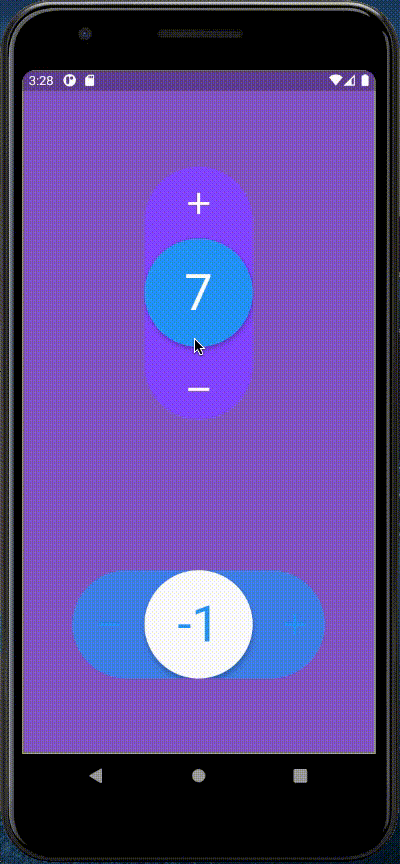

## Example



## How to use
- Import number_selection.dart
```
import 'package:number_selection/number_selection.dart';
```
- And here an use example
```
NumberSelection(
    theme: NumberSelectionTheme(
        draggableCircleColor: Colors.blue,
        iconsColor: Colors.white,
        numberColor: Colors.white,
        backgroundColor: Colors.deepPurpleAccent,
        outOfConstraintsColor: Colors.deepOrange),
    initialValue: 1,
    minValue: -10,
    maxValue: 10,
    direction: Axis.vertical,
    withSpring: true,
    onChanged: (int value) => print("value: $value"),
    enableOnOutOfConstraintsAnimation: true,
    onOutOfConstraints: () => print("This value is too high or too low"),
);
```
